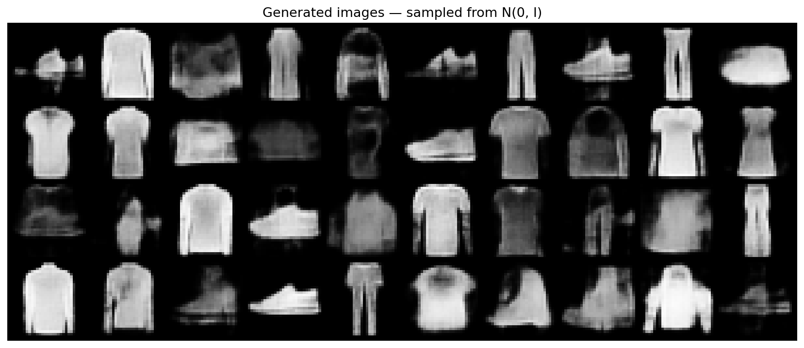
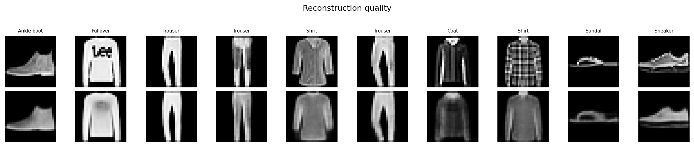
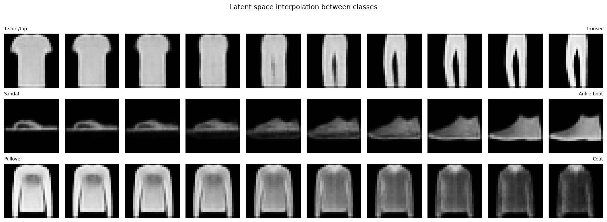
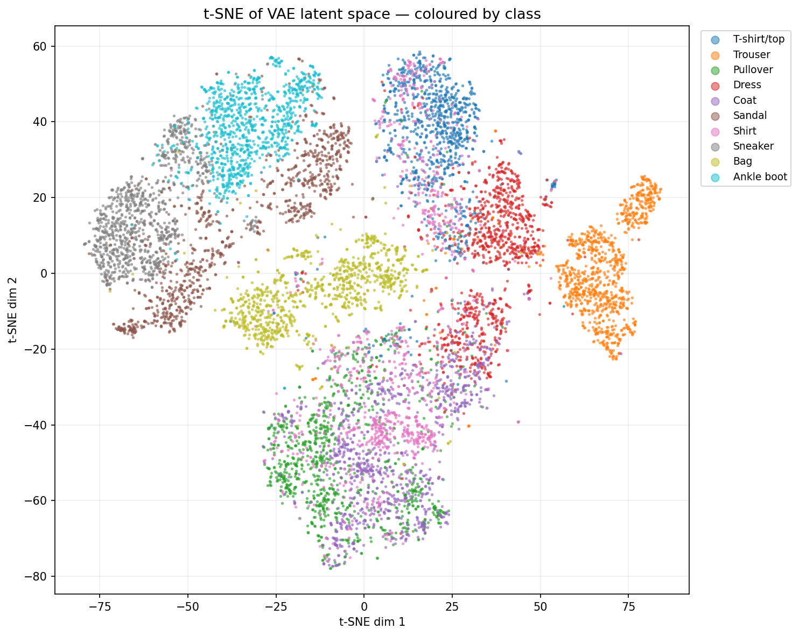
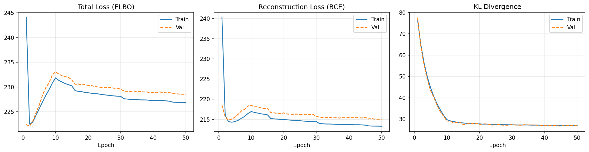

# Variational Autoencoder on Fashion-MNIST

A convolutional VAE trained on Fashion-MNIST that learns a structured, continuous latent space — enabling smooth interpolations between classes and coherent random generation.

---

## Results

### Random generation — sampling from N(0, I)


### Reconstruction quality


### Latent space interpolation between classes
Linearly interpolating between two encoded images shows smooth, semantically meaningful transitions — evidence of a well-structured latent space.



### t-SNE of the latent space (coloured by class)
Clusters emerge with no class labels during training — the VAE captures semantic structure unsupervised.



### Training curves


---

## Architecture

```
Input (1×28×28)
       │
  ┌────▼────┐
  │ Encoder │  Conv2d: 1→32→64→128  (stride 2, BatchNorm, LeakyReLU)
  └────┬────┘
  ┌────┴────┐
  │  μ   σ  │  two parallel Linear heads  →  latent dim 32
  └────┬────┘
       │  z = μ + ε·σ,   ε ~ N(0, I)   ← reparameterisation trick
  ┌────▼────┐
  │ Decoder │  ConvTranspose2d: 128→64→32→1  (stride 2, BatchNorm, LeakyReLU)
  └────┬────┘
       │
  Output (1×28×28)  [Sigmoid]
```

| Hyperparameter | Value |
|---|---|
| Latent dim | 32 |
| Encoder channels | 1 → 32 → 64 → 128 |
| Decoder channels | 128 → 64 → 32 → 1 |
| Trainable parameters | ~270k |

---

## Loss function

```
L = BCE(x̂, x) + β · KL(q(z|x) ∥ p(z))

KL = −½ Σ (1 + log σ² − μ² − σ²)
```

Both terms are **summed over their dimensions and averaged over the batch**, keeping them on the same numerical scale (~200 vs ~30 per sample). This is the critical detail that prevents **posterior collapse** — a failure mode where the KL term vanishes and the decoder ignores the latent code entirely.

β is annealed from 0 → 0.5 over the first 10 epochs, then held fixed. β < 1 biases the model towards reconstruction fidelity, yielding sharper generated images.

---

## Training

| Setting | Value |
|---|---|
| Optimizer | Adam, lr = 1e-3 |
| LR schedule | StepLR ×0.5 every 15 epochs |
| Batch size | 128 |
| Epochs | 50 |
| β (final) | 0.5 |
| KL annealing | 0 → 0.5 over 10 epochs |

---

## Setup

```bash
pip install torch torchvision scikit-learn matplotlib
```

Then open and run `vae_fashion_mnist.ipynb`. The Fashion-MNIST dataset is downloaded automatically on first run.

---

## Notebook contents

| Section | Description |
|---|---|
| 1. Imports & setup | Seeds, device |
| 2. Dataset | Fashion-MNIST loading, sample preview |
| 3. Architecture | Encoder, Decoder, VAE, loss function |
| 4. Training | Training loop with KL annealing |
| 5. Reconstruction | Original vs reconstructed images |
| 6. Interpolation | Linear walk through latent space between classes |
| 7. Generation | Random samples from N(0, I) |
| 8. t-SNE | 2D projection of the full test-set latent codes |
| 9. Save | Export model weights to `.pth` |

---

## Why VAE over a plain autoencoder for generation?

A plain AE maps each input to a **point** in latent space. The regions between those points are unstructured — decoding a random z produces noise.

A VAE regularises the latent space to approximate N(0, I) via the KL term. The space becomes **continuous and densely populated**: you can sample any z and decode it into a plausible image. Interpolation between two points produces a smooth, semantically meaningful transition rather than garbage.
